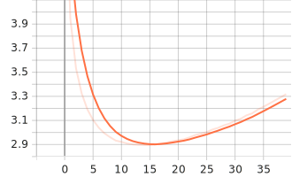
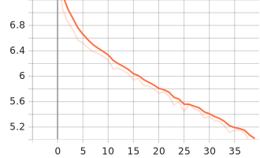
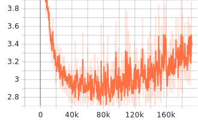
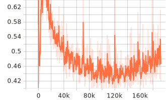
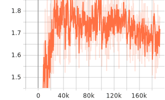
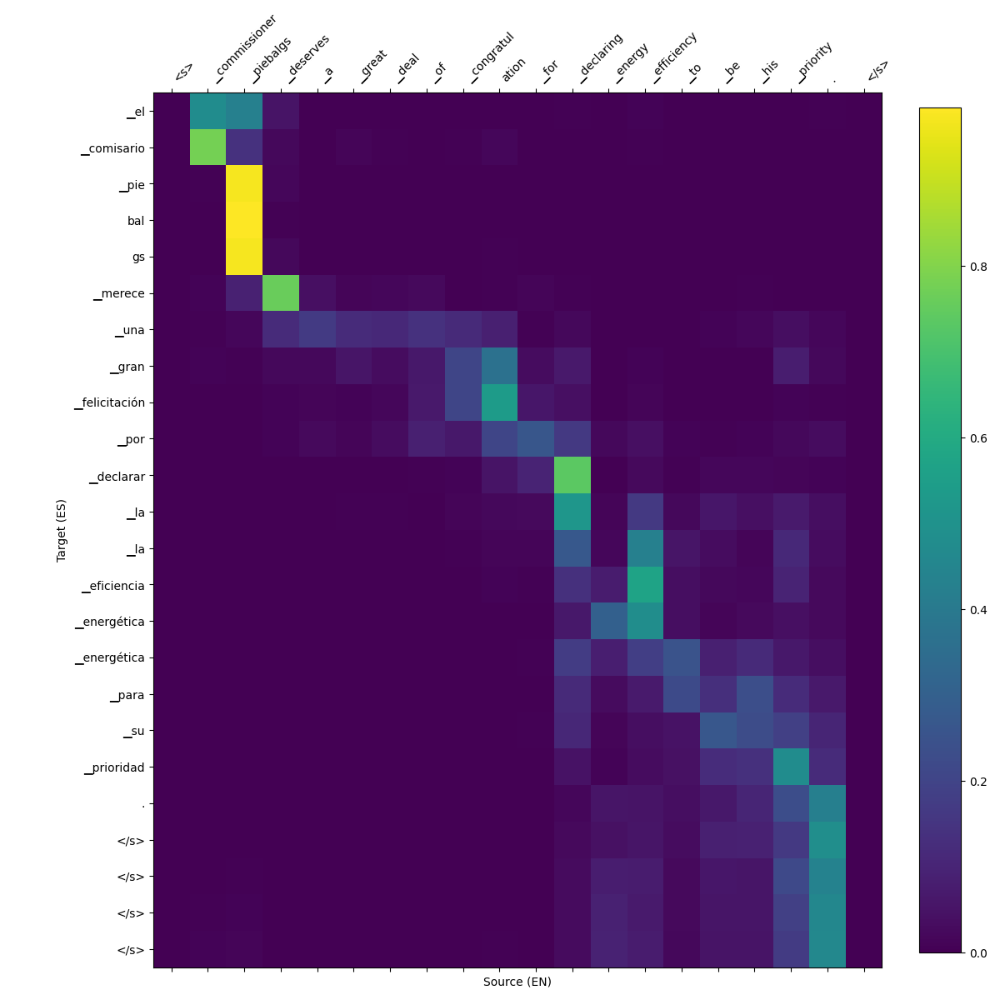
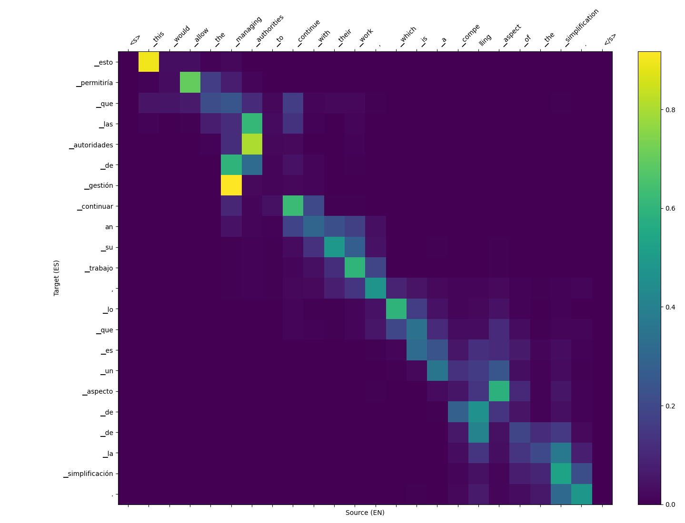
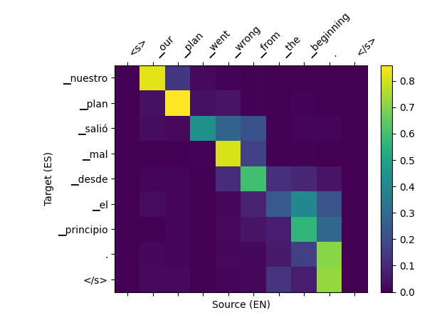

# LSTM English-to-Spanish Translator

A sequence-to-sequence neural machine translation system built **entirely from scratch** in PyTorch. Every component — LSTM cells, bidirectional encoder, attention mechanism, decoder, beam search — is implemented from first principles with no use of `torch.nn.LSTM` or pre-built seq2seq modules.

**Pre-trained model**: [huggingface.co/alexgara/lstm-en-es-translator](https://huggingface.co/alexgara/lstm-en-es-translator)

https://github.com/user-attachments/assets/76ef98ac-d618-4cf3-a45f-22ad45886e11

## Quick Start

```bash
git clone https://github.com/alexgarabt/lstm-translator.git
cd lstm-translator
uv sync

# Translate using the pre-trained model (downloads from HuggingFace)
uv run python scripts/inference.py --interactive

# Or translate a single sentence
uv run python scripts/inference.py --text "The weather is nice today"
```

## Architecture

```
Source (EN) → [Embedding 256d] → [BiLSTM 2×512] → encoder_outputs (1024d)
                                                          ↓
                                                  [Dot-Product Attention]
                                                          ↓
Target (ES) → [Embedding 256d] → [LSTM 2×512] → [Output Projection] → logits (16K vocab)
```

| Component | Details | Parameters |
|---|---|---|
| Encoder Embedding | 16K vocab × 256d | 4.1M (12.8%) |
| Encoder BiLSTM | 2 layers × 2 directions × 512 hidden | 7.3M (23.0%) |
| Encoder Projections | Hidden state mapping for decoder init | 1.0M (3.3%) |
| Decoder Embedding | 16K vocab × 256d | 4.1M (12.8%) |
| Decoder LSTM | 2 layers × 512 hidden | 5.8M (18.1%) |
| Attention + Combination | Dot-product scoring + context mixing | 1.3M (4.1%) |
| Output Projection | 512 → 16K vocab | 8.2M (25.8%) |
| **Total** | | **~31.9M** |

### Key Implementation Details

- **Custom LSTMCell**: Four gates (input, forget, candidate, output) with fused weight matrices for efficient GPU computation. Forget gate bias initialized to 1.0 for stable gradient flow (Jozefowicz et al., 2015).
- **Bidirectional Encoder**: Forward and backward LSTMs with concatenated outputs (1024d) and learned projection for decoder state initialization.
- **Luong Dot-Product Attention**: Score computation between decoder hidden state and all encoder outputs, padding mask with -∞, softmax normalization, weighted context vector.
- **Teacher Forcing Schedule**: Linear decay from 1.0 to 0.3 over training, gradually transitioning from ground-truth to model-predicted inputs.
- **Beam Search**: K-best sequence decoding with length normalization for inference.

## Training

### From Scratch

```bash
# Downloads data, trains tokenizers, trains model
uv run python scripts/train.py

# Monitor training
uv run tensorboard --logdir training/runs_v4/
```

### Hyperparameters

| Parameter | Value |
|---|---|
| Embedding dimension | 256 |
| Hidden dimension | 512 |
| Layers | 2 |
| Dropout | 0.35 |
| Batch size | 128 |
| Learning rate | 3e-4 (AdamW, weight_decay=1e-5) |
| Gradient clipping | 1.0 |
| Label smoothing | 0.1 |
| Teacher forcing | 1.0 → 0.3 (linear decay) |
| Max sequence length | 35 BPE tokens |
| BPE vocabulary | 16,000 per language |
| Epochs | 40 |

### Dataset

| Source | Pairs | Description |
|---|---|---|
| [Tatoeba](https://opus.nlpl.eu/Tatoeba.php) | ~222K | Short conversational sentences (median ~6 words) |
| [Europarl](https://opus.nlpl.eu/Europarl.php) | ~400K | European Parliament proceedings (filtered ≤30 words) |
| **Total** | **~622K** | Mixed conversational + formal register |

### Training Curves

<table>
<tr>
<td></td>
<td></td>
</tr>
<tr>
<td align="center">Train Loss (epoch)</td>
<td align="center">Validation Loss (epoch)</td>
</tr>
</table>

<table>
<tr>
<td></td>
<td></td>
<td></td>
</tr>
<tr>
<td align="center">Train Loss (step)</td>
<td align="center">Gradient Norm</td>
<td align="center">Attention Entropy</td>
</tr>
</table>

The train loss uptick after epoch ~16 is caused by teacher forcing decay — the training task becomes harder as the model increasingly relies on its own predictions. The validation loss (always fully autoregressive) decreases monotonically, confirming the model improves throughout training.

### Attention Visualization

The model learns interpretable source-target alignments. Attention heatmaps from validation examples:

<table>
<tr>
<td></td>
<td></td>
<td></td>
</tr>
</table>

## Inference

### Using the Pre-trained Model

```bash
# Interactive mode
uv run python scripts/inference.py --interactive

# Single sentence
uv run python scripts/inference.py --text "How are you?"

# Greedy only (no beam search)
uv run python scripts/inference.py --text "Hello" --beam-width 0

# CPU inference
uv run python scripts/inference.py --device cpu --interactive
```

### Example Translations

| English | Greedy | Beam (k=5) |
|---|---|---|
| Hello | hola. | hola. |
| How are you? | ¿cómo estás? | ¿cómo estás? |
| I love you | te quiero. | te amo. |
| The cat is black | el gato es negro. | el gato es negro. |
| Where is the hospital? | ¿dónde está el hospital? | ¿dónde está el hospital? |
| I want to eat | quiero quiero. | quiero comer. |
| I don't understand | no no lo entiendo. | no entiendo. |

Beam search eliminates the repetition artifacts visible in greedy decoding.

### Using a Local Checkpoint

```bash
uv run python scripts/translate.py
```

Edit `scripts/translate.py` to point to your local checkpoint path.

## Project Structure

```
├── src/translator/
│   ├── config.py                # Training configuration dataclass
│   ├── data/
│   │   ├── dataset.py           # PyTorch Dataset + collate function
│   │   ├── download.py          # Tatoeba/Europarl download
│   │   ├── preprocessing.py     # Pair loading, filtering, train/val/test split
│   │   └── tokenizer.py         # SentencePiece wrapper
│   ├── models/
│   │   ├── lstm.py              # Custom LSTMCell and LSTM from scratch
│   │   ├── encoder.py           # Bidirectional LSTM encoder
│   │   ├── decoder.py           # LSTM decoder with attention
│   │   ├── attention.py         # Luong dot-product attention
│   │   └── seq2seq.py           # Full model + beam search
│   └── training/
│       ├── trainer.py           # Training loop with TensorBoard logging
│       └── metrics.py           # Gradient norms, attention entropy, heatmaps
├── scripts/
│   ├── train.py                 # Main training script
│   ├── inference.py             # Translate using HuggingFace model
│   ├── translate.py             # Translate using local checkpoint
│   ├── hub.py                   # HuggingFace Hub download helpers
│   ├── upload_to_hf.py          # Upload model to HuggingFace
│   └── continue_training.py     # Resume training with LR decay
├── tests/
│   ├── test_lstm.py             # Unit tests for custom LSTM
│   ├── test_attention.py        # Unit tests for attention mechanism
│   ├── test_seq2seq.py          # Integration tests for full model
│   └── test_overfit.py          # Overfitting sanity check
└── img/training/                # Training curves and attention heatmaps
```

The `training/` directory (data, checkpoints, TensorBoard logs) is not tracked in git.

## Tests

```bash
uv run pytest tests/ -v
```

## Limitations

- Best suited for short-to-medium sentences (under 30 words)
- English → Spanish only (single direction)
- LSTM architecture is inherently sequential — slower inference than Transformer-based models
- Trained on conversational + parliamentary text — may struggle with specialized domains
- Greedy decoding shows repetition artifacts on some inputs (use beam search)

## References

- Sutskever et al. (2014) — [Sequence to Sequence Learning with Neural Networks](https://arxiv.org/abs/1409.3215)
- Bahdanau et al. (2015) — [Neural Machine Translation by Jointly Learning to Align and Translate](https://arxiv.org/abs/1409.0473)
- Luong et al. (2015) — [Effective Approaches to Attention-based Neural Machine Translation](https://arxiv.org/abs/1508.04025)
- Sennrich et al. (2016) — [Neural Machine Translation of Rare Words with Subword Units](https://arxiv.org/abs/1508.07909)

